# 🧪 PAWPATROL_FRONT

**Integrantes:**
- Juan Pablo Caballero Castellanos.
- Oscar Sanchez.
- Robinson Steven Nuñez.
- David Santiago Palacios.
- Diego Chavarro.

**Nombre De la Rama:**
`feature/proyecto_JuanCaballero_OscarSanchez_DiegoChavarro_RobinsonPortela_SantiagoPalacios_2025-2`

---

## SEMANA 4 - 6

---
## Pruebas de ejecución (Proyecto).

 

---

## Prototipo en Figma (Login y Dashboard):

### **Login:**
Creamos el login para los estudiantes para que puedan iniciar SIRHA

---

### **Recuperar contraseña:**

Si por casualidad algùn usuario de la escuela olvido su contraseña puede 
recuperarla con el codigo enviado a su correo institucional 

---

Confirmar enlace enviado al correo:

---

### **DashBoard Navegación del estudiante:**

Cuando se haya iniciando sesion nos llevara al dashboard en el cual
el usario de la escuela puede:

- Consultar sus calificaciones -> semaforo plan de estudios
- Consultar su horario de clases
- Realizar solicitudes para asignaturas y grupo
- Poder visualizar un resumen del semaforo de plan de estudios de:
  
  - El número de materias cursadas 🟢
  - El número de materias a cursar 🔵
  - El número de materias reprobadas 🔴

---

### **Fechas inscripciones**

Se podra consultar el horario de fechas de incripciones:

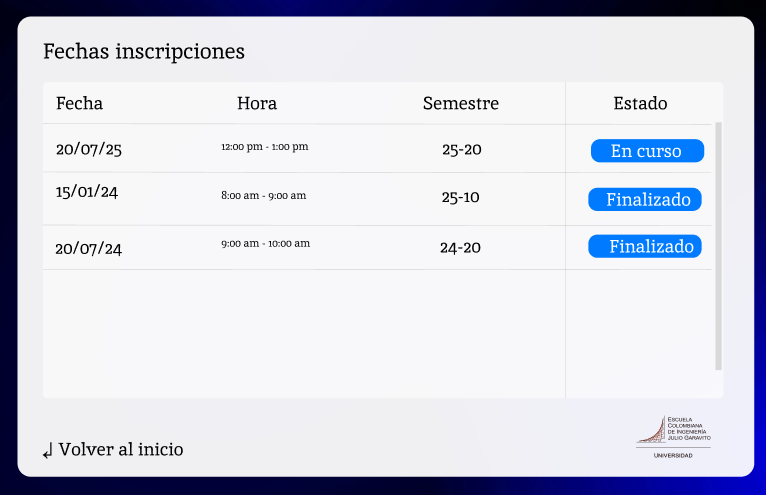

---

### **Horario**

En el horario se podran ver lo siguiente:

- Los dias de las semana que se estudia
- La hora de la clase y saber si esta terminada o proxima a empezar
- El aula en la cual se llevara a cabo

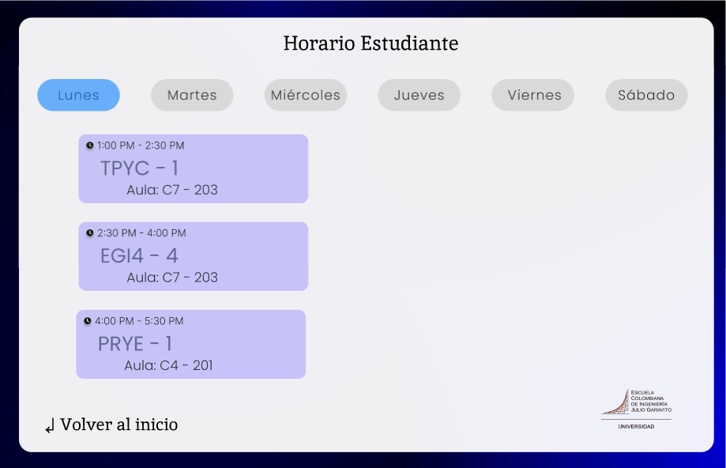

---

### **Horarios Anteriores**

El estudiante podra consultar lo mismo que el horario normal pero
podra ver su horario de cualquier semestre antes cursado

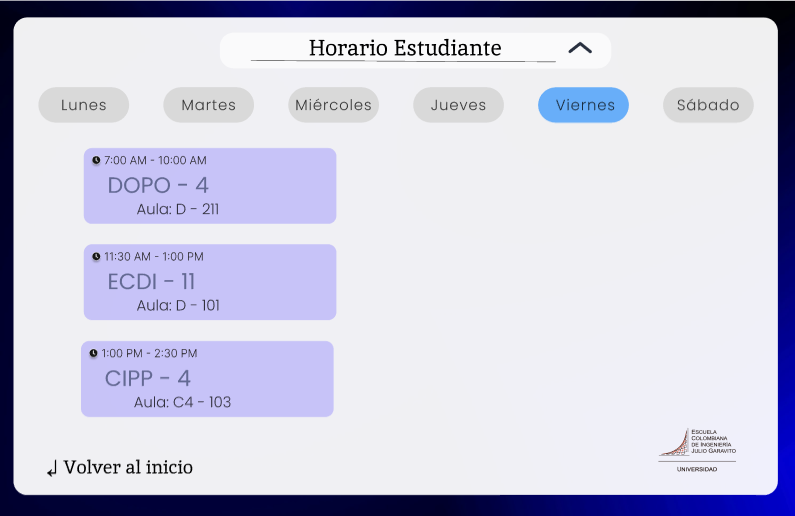

y el horario con semestres anteriores:

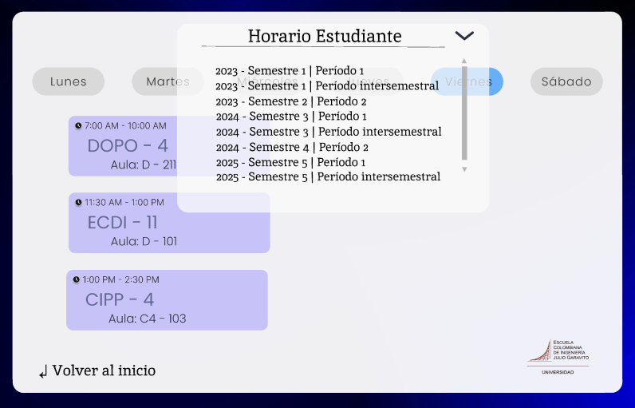

---

### **Semaforo / Historial de  Materias:**

Al darle en el semaforo en el dashboard nos llevara al Historial de Materias
en el cuál el estudiante podra revisar su(s):

- Materias cursadas en verde 🟢

---

- Materias a cursar; En progreso 🔵

---

- Materias reprobadas en rojo 🔴

---

### **Solicitudes:**

Al darle a solicitud en el dashboard nos llevara a la creación de solicitudes
en el cuál el estudiante podra:

- Crear solicitudes
- Elegir materia y grupo
- Consultar sugerencias por parte del sistema para realizar cambios
- Consultar observaciones adicionales 

---

Luego de que usuario al elegir la materia que quiere cambiar o 
tomar una sugerencia puede darle a cancelar y generar, en añadir clase se vera:

- Aqui decidira si aceptar su solicitud de cambio o cancelarda 

---

Si opta por aceptarla se le avisara sobre el estado de su solicitud:

---

- *El estudiante podra consultar el estado de sus solicitudes de manera que:*

  - Primero salen las solicitudes aprobadas en verde 🟢
  - Segundo salen las solicitudes de revisión en amarillo 🟡
  - Tercero salen las solicitudes pendientes en azul 🔵
  - Cuarto salen las solicitudes en rechazadas 🔴

---

- *Ademas podra observar diagramas de barras y su historial de cambio al darle en esadisticas:*

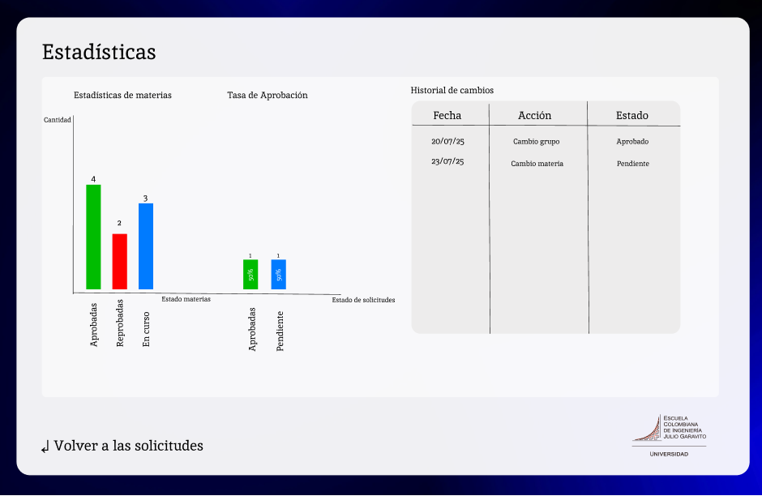

---

## SEMANA 7

---

### **DashBoard Navegación de administracion y decanatura:**

*Para las solicitudes se podra:*

- Gestionar las solicitudes 
- Consutar el número de solicitudes por facultad 
- Estadisticas de solicitudes en general 

*Para la gestion academica se podra:*

- Consultar una alerta de solicitudes para los cupos 
- Modificar los periodos de cambios 
- Adminitracio de los grupos y materias

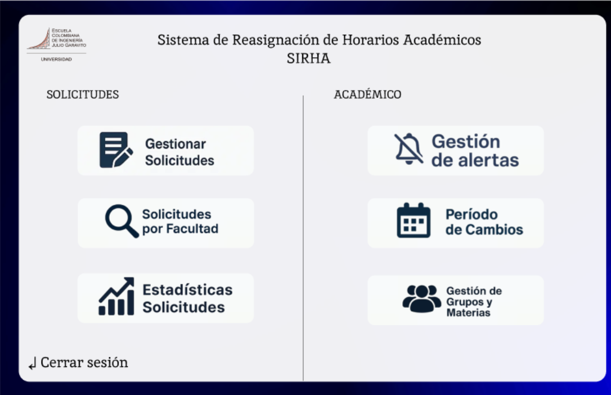

---

### **Alertas:**

Se podra consultar que materia y grupo estan por alcanzar la capacidad limite o si ya la alcanzaron

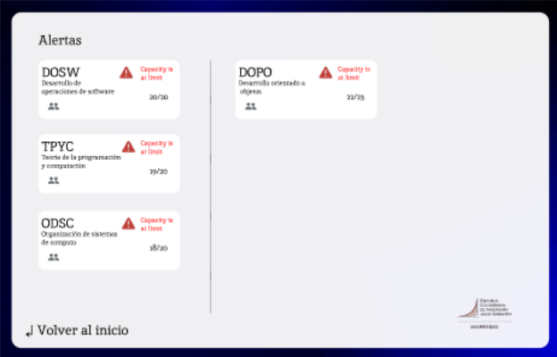

---

### **Solicitudes por Facultad:**

La decanatura podra revisar el número de solicitudes por facultad para
poder saber cual es a la que le llegan mas solicitudes

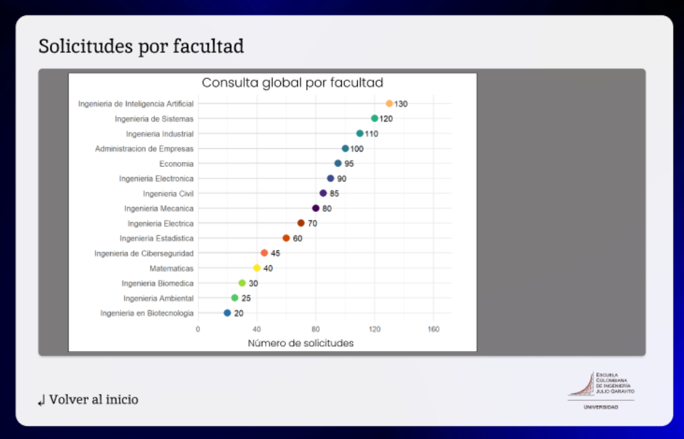

---

### **Gestión Solicitudes por Decanatura:**

Se encuentra:

- Fecha y hora de la solicitud para asegurar la prioridad de llegada
- El nombre del estudiante 
- Y el estado de la solicitud y un caso exepcional se mostrara en rojo 🔴

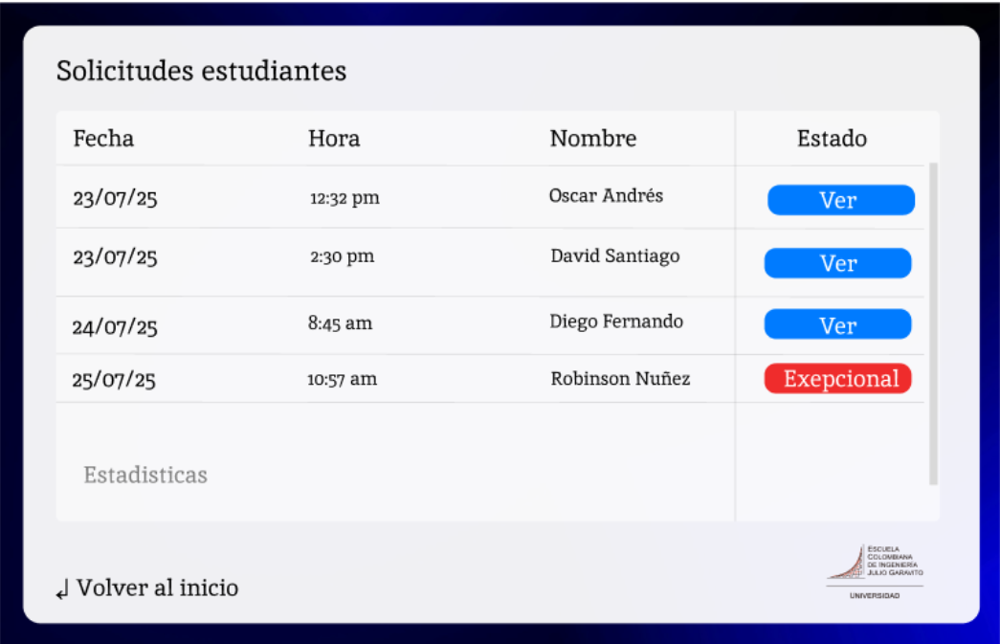

---

## Solicitudes normales:

Se podra consultar la:

Información del estudiante:
  - Codigo, nombre, carrera y semestre
  - El Horario del estudiante en el cual se podra ver si hay cruces de materias y las horas disponibles
  - Un espacio de las materias a cambiar, y consultar el grupo, cupos, lista de espera y estado de la asignatura a cambiar
  - El semaforo academico del estudiante del semestre actual
  - Estadisticas de las solicitudes del estudiante 

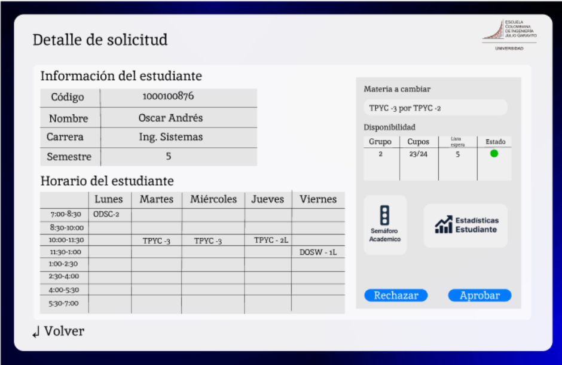

---

## Semaforo estudiantil:

Información semaforo plan de estudios del semestre actual del estudiante

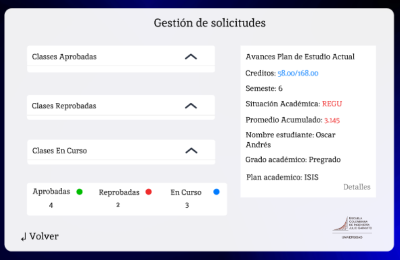

---

## Solicitudes excepcionales:

Esta solicitud se marcara en rojo para tenerla mayormente en cuenta en la 
ventana de gestion de solicitudes y se podra ver la observacion con el texto
y documentos que validen el caso de cambio.

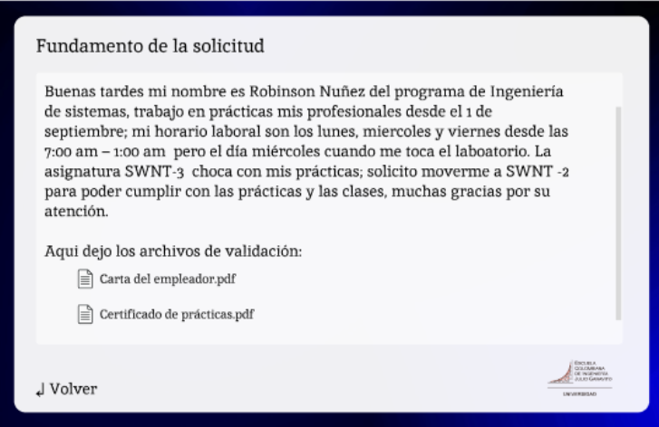

---

##  Estaditicas solicitudes del estudiante:

Se podra ver el historial de solicitudes del estudiante

- Un diagrama de barras de las materias aprobadas, reprobadas y en curso
- Y la tasa de aprobación de sus solicitudes de aprobacion y pendientes

---

##  Gestión Asignaturas y Grupos:

Se podra hacer lo siguiente:

- Especificar la asignatura a inscribir 
- El Grupo 
- Y establecer el cupo máximo 
- Asignar un profesor
- Asignar el horario
- Ademas un apartado para consultar los grupos, maeterias, profesor, horario, capacidad y estado

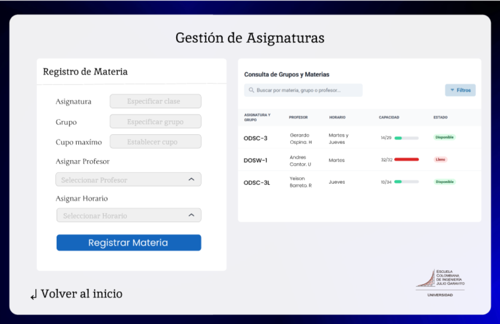

---

##### Link evidencia Figma:  https://www.figma.com/design/sDfQYNbAqlXn4blPiYqOxL/Mock-SIRHA?node-id=0-1&p=f&t=DWceu8mj7m3adYFg-0

---

### EPIC - FEATURE - UH

**Tarea de Figma finalizada Login y DashBoard:**

**Tarea de Figma finalizada Horario y Semaforo**

**Tarea de Figma finalizada MockUp Solicitudes**

**Tarea Refactorización de los MockUps:**

