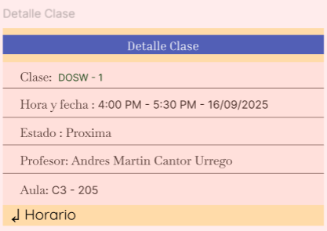
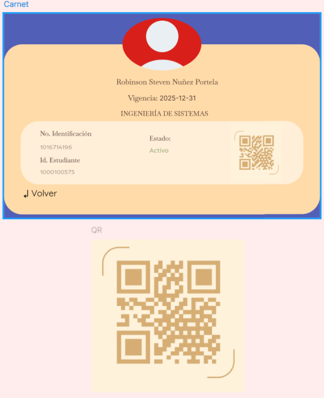
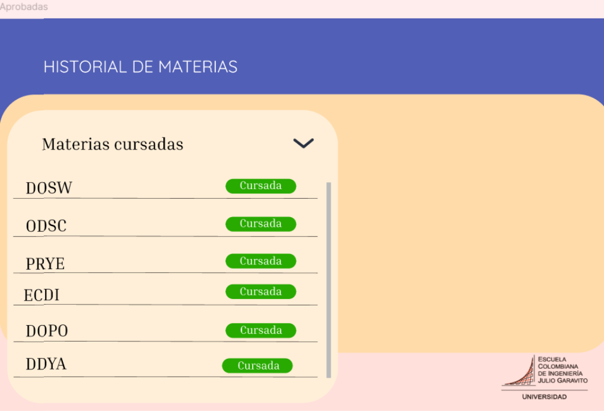

# 🧪 PAWPATROL_FRONT

**Integrantes:**
- Juan Pablo Caballero Castellanos.
- Oscar Sanchez.
- Robinson Steven Nuñez.
- David Santiago Palacios.
- Diego Chavarro.

**Nombre De la Rama:**
`feature/proyecto_JuanCaballero_OscarSanchez_DiegoChavarro_RobinsonPortela_SantiagoPalacios_2025-2`

---
## Pruebas de ejecución (Proyecto).

 

---

## Prototipo en Figma (Login y Dashboard):

### **Login:**
Creamos el login para los estudiantes para que puedan iniciar SIRHA

---

### **Recuperar contraseña:**

Si por casualidad algùn usuario de la escuela olvido su contraseña puede 
recuperarla con el codigo enviado a su correo institucional 

---

### **DashBoard:**

Cuando se haya iniciando sesion nos llevara al dashboard en el cual
el usario de la escuela puede:

- Usar su carnet para ingresar a la universidad
- Consultar sus calificaciones -> semaforo plan de estudios
- Consultar su horario de clases
- Realizar solicitudes para asignaturas y grupo
- Poder visualizar un resumen del semaforo de plan de estudios de:
  
  - El número de materias cursadas 🟢
  - El número de materias a cursar 🔵
  - El número de materias reprobadas 🔴

---

### **Horario**

En el horario se podran ver lo siguiente:

- Los dias de las semana que se estudia
- La hora de la clase y saber si esta terminada o proxima a empezar
- El aula en la cual se llevara a cabo

*Si el estudiante o profesor desea saber mas detalles de la clase nos lleva a:*

- Aqui podremos consultar lo mismo pero con el nombre del profesor y la fecha y hora

---

### **Carnet:**

El estudiante puede usar su carnet para entrar a la universidad

- Estan sus datos y se encuenta activo su carnet

---

### **Semaforo / Historial de  Materias:**

Al darle en el semaforo en el dashboard nos llevara al Historial de Materias
en el cuál el estudiante podra revisar su(s):

- Materias cursadas en verde 🟢

---

- Materias a cursar; En progreso 🔵

---

- Materias reprobadas en rojo 🔴

---

### EPIC - FEATURE - UH

**Tarea de Figma finalizada Login y DashBoard:**

**Tarea de Figma finalizada Login y DashBoard**

