# 🧪 PAWPATROL_FRONT

**Integrantes:**
- Juan Pablo Caballero Castellanos.
- Oscar Sanchez.
- Robinson Steven Nuñez.
- David Santiago Palacios.
- Diego Chavarro.

**Nombre De la Rama:**
`feature/proyecto_JuanCaballero_OscarSanchez_DiegoChavarro_RobinsonPortela_SantiagoPalacios_2025-2`

---
## Pruebas de ejecución (Proyecto).

 

---

## Prototipo en Figma (Login y Dashboard):

### **Login:**
Creamos el login para los estudiantes para que puedan iniciar SIRHA

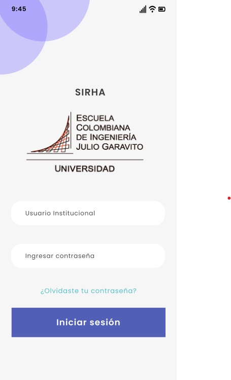

---

### **Recuperar contraseña:**

Si por casualidad algùn usuario de la escuela olvido su contraseña puede 
recuperarla con el codigo enviado a su correo institucional 

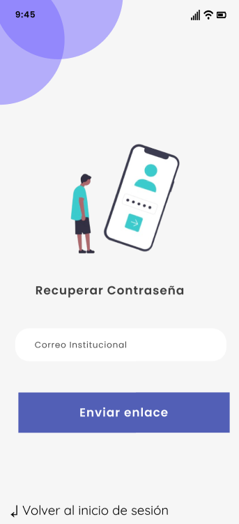

---

Confirmar enlace enviado al correo:

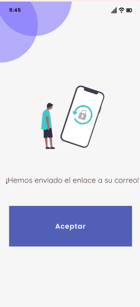

---

### **DashBoard:**

Cuando se haya iniciando sesion nos llevara al dashboard en el cual
el usario de la escuela puede:

- Consultar sus calificaciones -> semaforo plan de estudios
- Consultar su horario de clases
- Realizar solicitudes para asignaturas y grupo
- Poder visualizar un resumen del semaforo de plan de estudios de:
  
  - El número de materias cursadas 🟢
  - El número de materias a cursar 🔵
  - El número de materias reprobadas 🔴

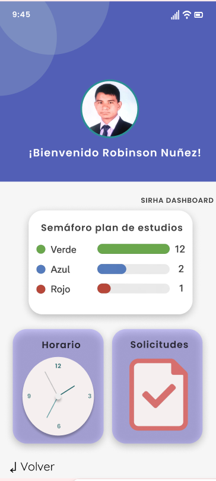

---

### **Horario**

En el horario se podran ver lo siguiente:

- Los dias de las semana que se estudia
- La hora de la clase y saber si esta terminada o proxima a empezar
- El aula en la cual se llevara a cabo

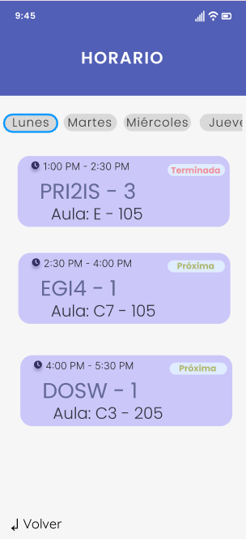

### **Semaforo / Historial de  Materias:**

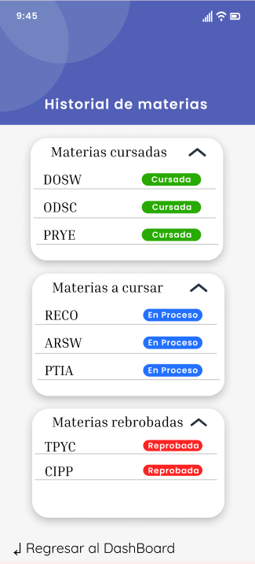

Al darle en el semaforo en el dashboard nos llevara al Historial de Materias
en el cuál el estudiante podra revisar su(s):

- Materias cursadas en verde 🟢

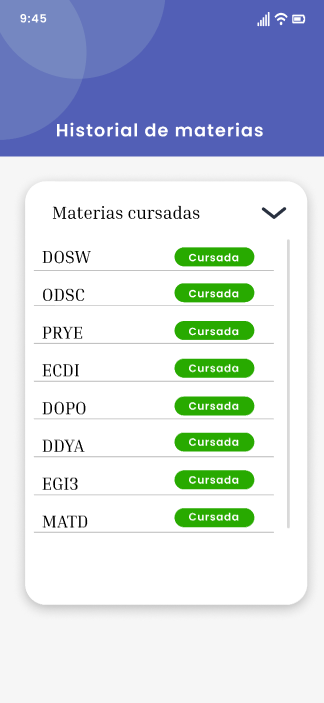

---

- Materias a cursar; En progreso 🔵

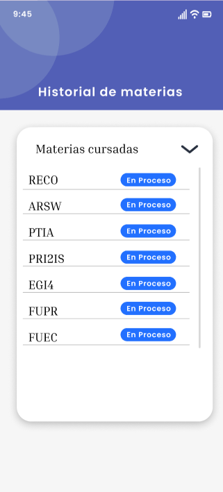

---

- Materias reprobadas en rojo 🔴

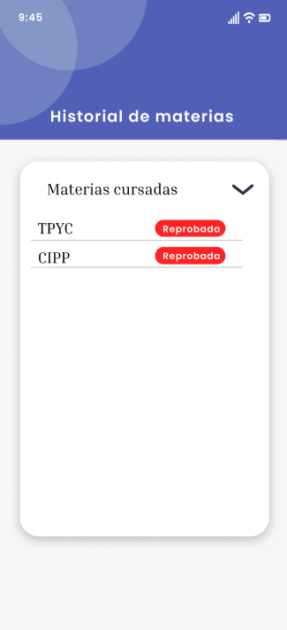

---

### **Solicitudes:**

Al darle a solicitud en el dashboard nos llevara a la creación de solicitudes
en el cuál el estudiante podra:

- Crear solicitudes
- Elegir materia y grupo
- Consultar sugerencias por parte del sistema para realizar cambios
- Consultar observaciones adicionales 

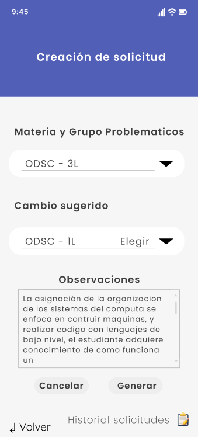

---

Luego de que usuario al elegir la materia que quiere cambiar o 
tomar una sugerencia puede darle a cancelar y generar, al darle generar lo llevara a:

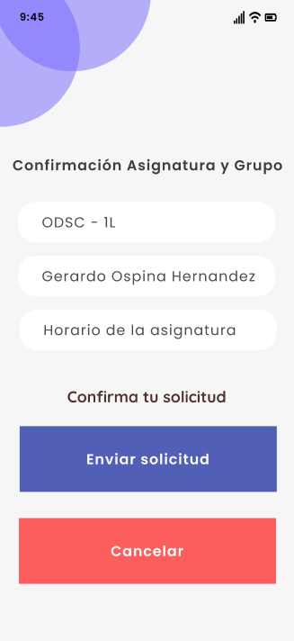

- Aqui decidira si aceptar su solicitud de cambio o cancelarda 

---

Si opta por aceptarla se le avisara sobre el estado de su solicitud:

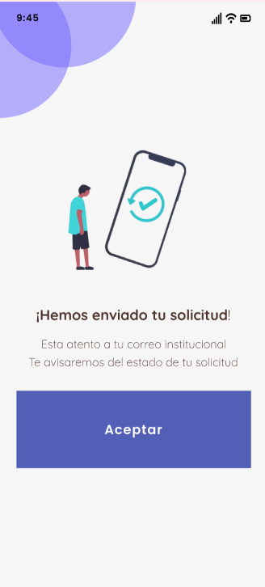

---

- *El estudiante podra consultar el estado de sus solicitudes de manera que:*

  - Primero salen las solicitudes aprobadas en verde 🟢
  - Segundo salen las solicitudes de revisión en amarillo 🟡
  - Tercero salen las solicitudes pendientes en azul 🔵
  - Cuarto salen las solicitudes en rechazadas 🔴

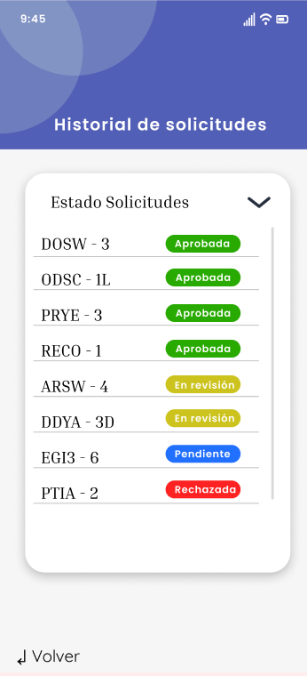

---

##### Link evidencia Figma:  https://www.figma.com/design/sDfQYNbAqlXn4blPiYqOxL/Mock-SIRHA?node-id=0-1&p=f&t=DWceu8mj7m3adYFg-0

---

### EPIC - FEATURE - UH

**Tarea de Figma finalizada Login y DashBoard:**

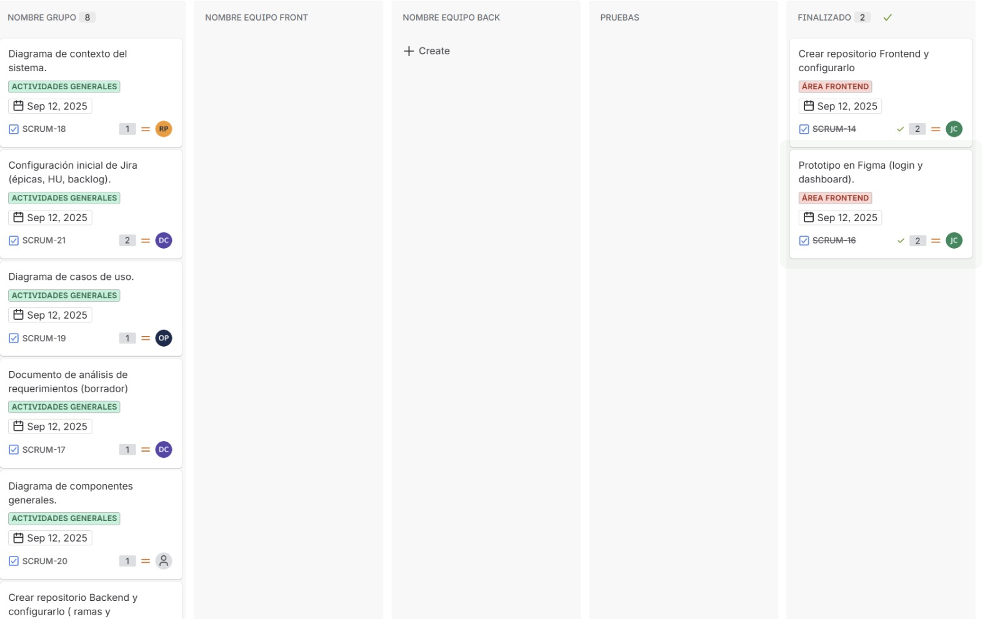

**Tarea de Figma finalizada Horario y Semaforo**

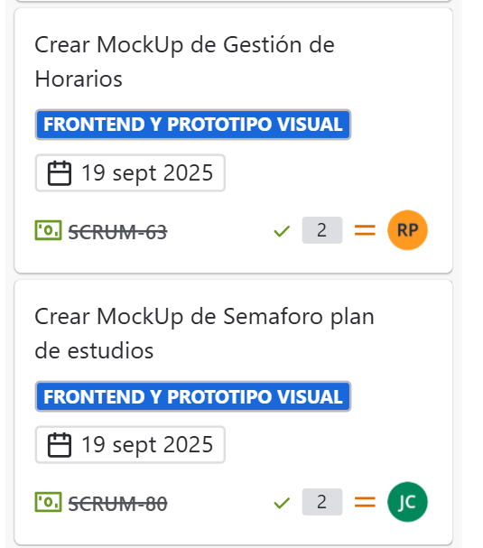

**Tarea de Figma finalizada MockUp Solicitudes**
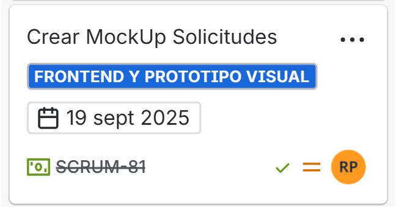

**Tarea Refactorización de los MockUps:**
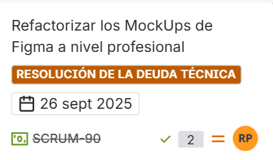

